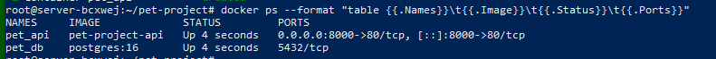
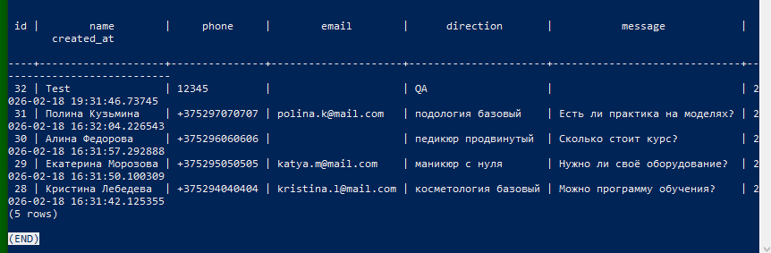

# BA-project

Backend API for beauty academy lead collection.

## Features
- FastAPI + PostgreSQL
- Docker Compose deployment
- Nginx reverse proxy
- Swagger/OpenAPI protected with HTTP Basic Auth
- Public endpoints for lead creation

## Endpoints
- `GET /ping` — health check
- `POST /leads` — create lead
- `GET /leads` — list leads
- `GET /leads/{lead_id}` — get lead by id
- `GET /docs`, `/openapi.json`, `/redoc` — protected (Basic Auth)

## Local run (example)
```bash
cd infra
cp .env.example .env
# edit .env
docker compose -f docker-compose.yml.example up -d --build
curl http://127.0.0.1:8000/ping

---

## Proof of Deployment

### Docker Containers


### Healthcheck (200 OK)


### Protected OpenAPI/Swagger (401 Unauthorized)


### Database Records


